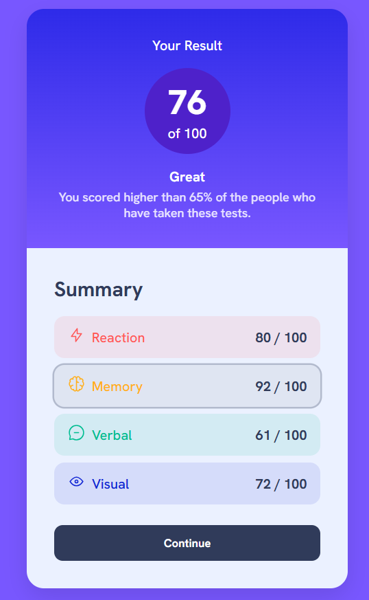

# AISA Solution Front-End Engineer Intern Challenge - Results summary component

This is a solution to the [Results summary component challenge on Frontend Mentor](https://www.frontendmentor.io/challenges/results-summary-component-CE_K6s0maV). Frontend Mentor challenges help you improve your coding skills by building realistic projects. 

## Table of contents

  - [Screenshot](#screenshot)
  - [Links](#links)
- [My process](#my-process)
  - [Built with](#built-with)
  - [What I learned](#what-i-learned)
  - [Continued development](#continued-development)
  - [Useful resources](#useful-resources)
- [Author](#author)

EDIT THE CONTENTS

### Screenshot

### Links

- Solution URL: [Add solution URL here](https://github.com/ray-1s/Results-summary-challenge)

## My process

### Built with

-Semantic HTML5 markup
-CSS custom properties
-Flexbox
-Responsive card layout
-JavaScript for dynamic data injection from JSON
-JSON file for structured data storage
-Google Fonts (Hanken Grotesk)

### What I learned
-How to fetch and parse JSON and use it to dynamically build UI elements
-Making the UI accessible by adding tabindex="0" so rows are keyboard-focusable
-I also learned how to use GitHub better. Since I had only used it once/twice before, this project helped me get more comfortable with the entire process of pushing code, managing files and updating my README so others can view my work clearly

### Continued development

-Better accessibility features (such as ARIA labels for the score section)
-Adding animations for row hover/focus transitions
-Making the layout fully responsive across larger screen sizes
-Experimenting with hosting JSON externally

### Useful resources

- AI tools: Helped me debug and understand how to use GitHub properly.
-Stack Overflow: Used to look up explanations for JavaScript errors and better understand how fetch() works when pulling in JSON data.

## Author

- Website - [Shreya Sargam](www.linkedin.com/in/shreya-sargam)

